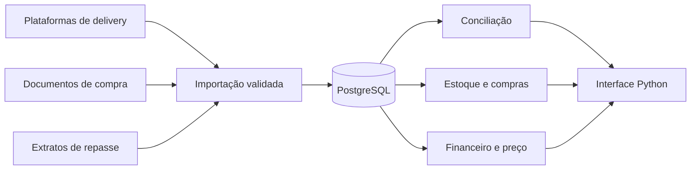

# FLAME OFFICE — migração de uma planilha para um sistema de gestão

Projeto de migração de um sistema operacional baseado em Excel/VBA/Power Query para uma aplicação modular de conciliação de delivery, estoque, compras, finanças e precificação. O desenho prevê PostgreSQL no Supabase e uma interface em Python.

**Estado:** levantamento funcional e modelo conceitual inicial. Ainda não há esquema de banco, integração ou interface implementados neste repositório. O proprietário do sistema fará a implementação; esta documentação registra as decisões e o caminho de migração.

## Objetivo

Conectar vendas e repasses das plataformas ao consumo de insumos, às compras e aos resultados financeiros. Cada valor exibido deve poder ser rastreado até um pedido, documento, movimento ou evento de origem.

## Módulos previstos

| Módulo | Finalidade |
|---|---|
| Integrações | Importar pedidos, itens, eventos e extratos em XML/JSON; manter origem e permitir reprocessamento. |
| Catálogo e produção | Cadastrar produtos vendáveis, itens de estoque, fichas técnicas e combos com escolhas reais por pedido. |
| Estoque e compras | Registrar movimentos, contagens, custo médio móvel, fornecedores, cotações e sugestões de compra. |
| Conciliação | Comparar valor esperado com repasses informados pela plataforma; investigar diferenças. |
| Financeiro | Contas a pagar e receber, fluxo de caixa, DRE e capital de giro. |
| Precificação | Simular preço, taxas, promoções e margem com volume previsto ou realizado de pedidos. |
| Painéis | Mostrar indicadores por loja, canal e período, com acesso ao registro que originou cada valor. |

O modelo atende uma loja inicialmente e prevê outras lojas no futuro. Uma integração bancária por Open Finance pode ser adicionada depois da conciliação dos extratos das plataformas.

## Documentação

- [Inventário funcional do legado](docs/01_inventario_funcional.md): funções existentes e destino proposto.
- [Modelo conceitual](docs/02_modelo_conceitual.md): entidades, fluxos e regras de desenho.
- [Roteiro de migração](docs/03_roteiro.md): sequência de trabalho e critérios de conferência.

## Escopo público

Este repositório contém somente uma descrição generalizada do sistema. A planilha original, dados de clientes e vendas, extratos, documentos fiscais, código VBA extraído, caminhos locais, indicadores internos, credenciais e configurações de produção permanecem fora dele. Exemplos futuros deverão usar dados sintéticos.

O modelo é uma proposta em evolução. Regras de cancelamento, estorno, custo retroativo, permissões e contratos de integração dependem de validação antes da implementação.
