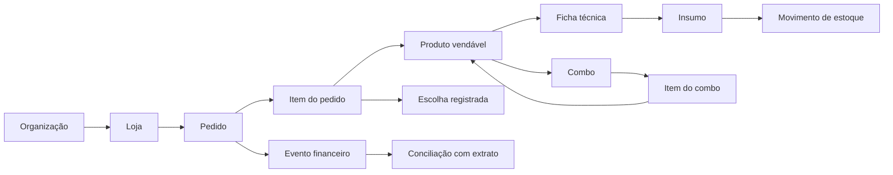

# Modelo conceitual proposto

O desenho começa com uma loja e permite várias lojas. Identificadores internos são estáveis; códigos de plataforma, fornecedor e documentos são atributos de origem, mantidos no formato recebido. O esquema SQL definitivo será definido após validar arquivos e regras de negócio.

## Entidades por domínio

| Domínio | Entidades candidatas | Relação central |
|---|---|---|
| Organização | organização, loja, usuário e permissão | Uma organização pode ter várias lojas. |
| Integrações | plataforma, conta, lote e registro de origem | Cada importação conserva fonte, versão, estado e erros. |
| Catálogo | produto vendável, item de estoque, unidade e conversão | Produto vendido pode consumir vários insumos; unidade de compra pode diferir da unidade de consumo. |
| Fornecedores | fornecedor, linhas de compra e cotações futuras | Um item interno pode ter vários fornecedores; o vínculo inicial vem das entradas registradas. |
| Produção | ficha técnica, componente, combo e item do combo | Ficha técnica descreve insumos do produto; combo descreve produtos vendáveis que o compõem. |
| Vendas | pedido, item e escolha do item | O pedido registra a composição realmente escolhida pelo cliente. |
| Estoque | contagem, movimento e custo aplicado | Saldo é explicado por abertura, entradas, saídas e ajustes. |
| Conciliação | evento financeiro, extrato e vínculo | Valor esperado e repasse confirmado têm fontes e estados próprios. |
| Financeiro | conta, parcela, pagamento, categoria e cenário | Previsão e realização permanecem distintas. |
| Precificação | regra de preço, promoção e cenário | Taxas, custos e volumes usados no cálculo ficam rastreáveis. |

O ciclo no diagrama representa a possibilidade de um combo incluir outro item vendável. **Referências circulares reais devem ser rejeitadas** ao cadastrar a composição.

## Regras de desenho já direcionadas

- **Fichas e combos separados:** produto avulso usa ficha técnica; combo reúne produtos vendáveis. A expansão até insumos considera a escolha e a versão registradas no pedido.
- **Estoque auditável:** contagem física na virada, seguida de movimentos com origem. Custo médio móvel para entradas elegíveis; a saída conserva o custo aplicado no momento.
- **Importação idempotente:** repetir um lote não cria novos pedidos, movimentos ou contas. Erros de mapeamento ficam visíveis para correção.
- **Conciliação por evidência:** o vencimento previsto não comprova pagamento. Extrato de plataforma confirma o repasse; confirmação bancária poderá ser uma etapa posterior.
- **Preço reproduzível:** mostrar margem com volume previsto e realizado, taxas por canal e impacto de promoção.
- **Segurança por loja:** acesso e relatórios precisam respeitar a loja e o papel do usuário. A política concreta depende do cadastro de usuários.

## Responsabilidade de cada camada

| Camada | Responsabilidade |
|---|---|
| Importador Python | Ler e validar XML/JSON, preservar origem, mapear códigos e registrar lotes/rejeições. |
| PostgreSQL local | Garantir relações, unicidade e operações transacionais; guardar movimentos, eventos e auditoria; oferecer consultas de apuração. |
| Interface Python | Cadastrar, revisar divergências, aprovar contagens e custos, operar conciliação e apresentar indicadores. |

Nem toda macro vira trigger. Operações com várias entidades, como registrar compra, estornar venda ou aprovar contagem, precisam de ação transacional explícita. Triggers pequenos podem atender auditoria e invariantes locais. Na primeira versão local, a aplicação Python deve usar um usuário próprio do banco com permissões mínimas, e o PostgreSQL não deve ser exposto diretamente à internet. Se houver acesso remoto no futuro, será necessário revisar autenticação e isolamento por loja.
